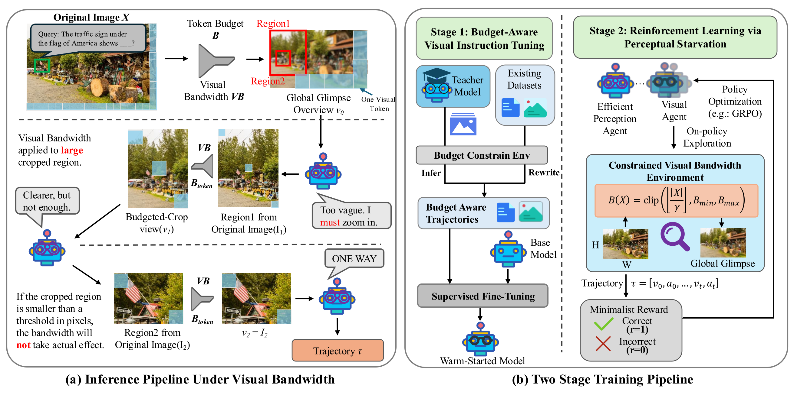
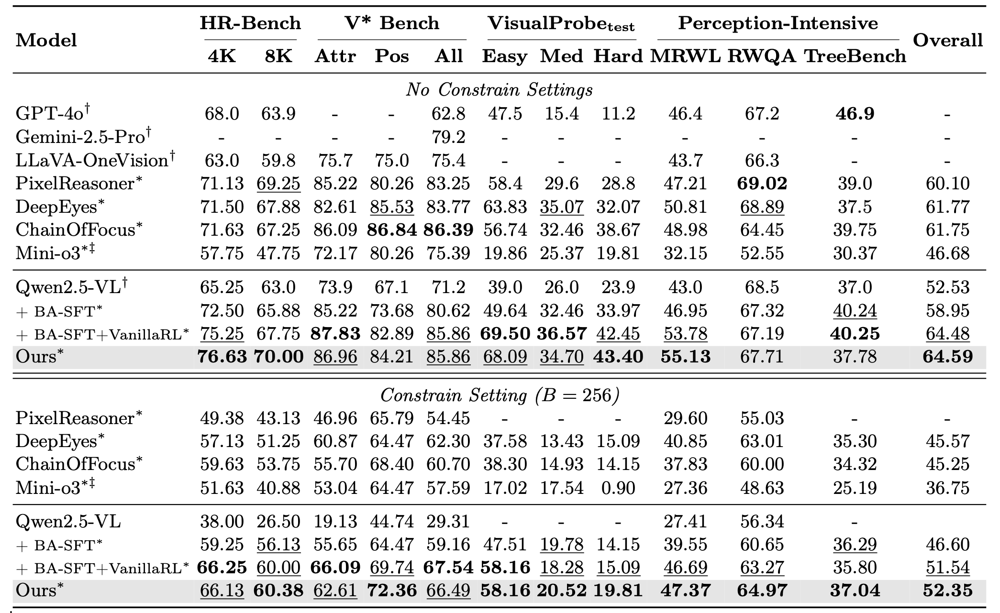
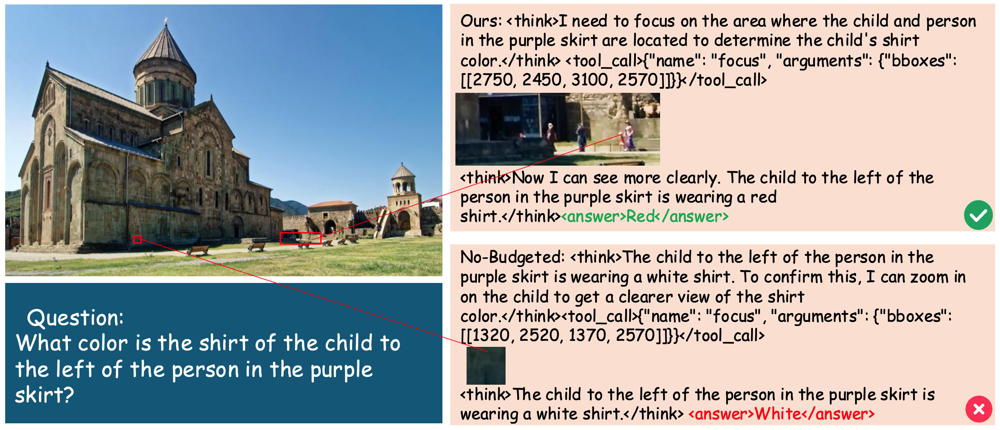

# Starve to Perceive: Taming Lazy Perception in VLMs with Constrained Visual Bandwidth

[](https://arxiv.org/abs/2605.18603)

Official training and evaluation code for **[Starve to Perceive: Taming Lazy Perception in VLMs with Constrained Visual Bandwidth](https://arxiv.org/abs/2605.18603)**.

Yuhuan Wu<sup>1</sup>, Cong Wei<sup>2</sup>, Fangzhen Lin<sup>1</sup>, Wenhu Chen<sup>2</sup>, Haozhe Wang<sup>1 †</sup>

<sup>1</sup>The Hong Kong University of Science and Technology &nbsp; <sup>2</sup>University of Waterloo

Built on top of [volcengine/verl](https://github.com/volcengine/verl) and [hiyouga/LLaMA-Factory](https://github.com/hiyouga/LLaMA-Factory); see [`train/rl/verl_starve/Notice.txt`](train/rl/verl_starve/Notice.txt) for attribution.

---

## TL;DR

VLMs trained to zoom, crop, and pan learn to *emit* those operations without functionally depending on their outputs — a failure we call **lazy perception**. The cause is a learning asymmetry: when a coarse global view plus language priors already gets you moderate accuracy, nothing pushes the model toward harder multi-step visual search. **If a model can succeed without actively looking, it will never learn to look.**

**Starve to Perceive** removes the shortcut by constraining *visual bandwidth*. Every observation is capped at a tight token budget $B_{pix}$, so no single view suffices: the first observation is an *overview* capped at $16 \times 16 \times 28 \times 28$ pixels, and the only way to recover detail is a `focus` call whose bounding boxes crop from the **original** pixel space — with every returned crop re-constrained to the same budget. Active perception stops being optional and becomes the only viable strategy.

No auxiliary losses, no reward shaping, no architectural changes — a plug-in modification to a standard post-training pipeline (cold-start SFT, then multi-turn GRPO) that yields **5% average relative improvement** across diverse benchmarks.



The budget is resolution-dependent rather than a flat constant — it scales with the image and is then clipped:

```
B(X) = clip( ceil(|X| / γ), B_min, B_max )
```

and applies uniformly to the global glimpse $v_0$ and to every subsequent crop:

```
v_0          = constrain(original,        max_tokens = B)
focus(bbox)  = constrain(original[bbox],  max_tokens = B)
```

Because crops come from the original image but are shown at the same budget, a tighter box buys strictly more effective resolution. One consequence worth noting: if a requested region is already smaller than the budget threshold, the bandwidth constraint is a no-op and the crop is returned as-is ($v_2 = I_2$) — the constraint only bites on large regions, so it never penalizes a well-aimed zoom. The agent's only lever on perception is *where* to look and *how tightly*.

## What this repository contains

```
Starve2Perceive/
├── train/
│   └── rl/verl_starve/                             # vendored verl + Starve2Perceive additions
│       ├── examples/agent/run.sh                   #   main RL entry point
│       ├── verl/workers/agent/parallel_env.py      #   multi-turn rollout loop (generate → step → obs)
│       ├── verl/workers/agent/envs/mm_process_engine/fixretina_tool.py
│       │                                           #   `focus` tool: bbox → original-space crop → B_pix
│       ├── verl/utils/dataset/rl_dataset_fixretina.py
│       │                                           #   seed_img / pixel_budget_per_image plumbing
│       ├── verl/utils/curriculum.py                #   B_pix schedulers (absolute / ratio)
│       ├── verl/utils/reward_score/fixretina.py    #   accuracy (LLM-as-judge) + format reward
│       └── verl/workers/reward_manager/prime.py    #   threaded reward manager
├── eval/
│   ├── eval_w_tool/                                # tool-calling evaluation harness
│   │   ├── run_inference.py, run_evaluation.py     #   inference + judging entry points
│   │   ├── inference_agent/                        #   our agent + reimplemented baselines
│   │   └── datasets/                               #   per-benchmark loaders (unified output format)
│   └── eval_scripts/                               # ready-to-run per-benchmark shell scripts
│       ├── tool/                                   #   tool-calling agents (infer + judge pairs)
│       └── vlmevalkit/                             #   single-turn baselines via VLMEvalKit
├── data/
│   ├── rl/                                         # RL data construction → fixretina parquet
│   ├── sft/                                        # SFT trajectory data
│   └── benchmarks/prepare.sh                       # benchmark download commands
└── delopy/vllm/                                    # vLLM serving scripts (policy, judge, baselines)
```

## Environment: the constrained-bandwidth setting

Internally the environment, tools, and data schema are all named `fixretina` — the "fixed retina" the agent has to work through. Wherever you see that name in the code, it refers to the bandwidth constraint described here.

Every training and evaluation sample carries the budget with it, so the same constraint holds end to end:


| Field                               | Meaning                                                      |
| ------------------------------------- | -------------------------------------------------------------- |
| `images`                            | the overview image, already capped at`max_view_pixels`       |
| `extra_info.seed_img`               | original image bytes +`scale` (overview → original mapping) |
| `extra_info.pixel_budget_per_image` | $B_{pix}$ for this sample                                    |
| `env_name`                          | `fixretina`, selects the tool/env at rollout time            |

The agent is handed a single tool:

```json
{"type":"function","function":{"name":"focus",
 "description":"Request a high-resolution local region of the first image and zoom in",
 "parameters":{"type":"object","properties":{"bboxes":{"type":"array","minItems":1,"maxItems":3,
   "items":{"type":"array","items":{"type":"integer"},"minItems":4,"maxItems":4,
   "description":"[x1, y1, x2, y2] in ABSOLUTE PIXEL COORDINATES of the first image."}}},
 "required":["bboxes"]}}}
```

and responds in `<think>` / `<tool_call>` / `<answer>` format, up to `max_turns` interaction rounds with at most 3 boxes per turn. Full prompts live in [`eval/eval_w_tool/inference_agent/prompts.py`](eval/eval_w_tool/inference_agent/prompts.py) and [`train/rl/verl_starve/verl/workers/agent/envs/mm_process_engine/prompt.py`](train/rl/verl_starve/verl/workers/agent/envs/mm_process_engine/prompt.py).

## Pretrained checkpoints

<!-- TODO: fill in HuggingFace links once the checkpoints are released -->


| Checkpoint               | Role                                                                         | Download |
| -------------------------- | ------------------------------------------------------------------------------ | ------------- |
| `Starve2Perceive-7B-SFT` | Qwen2.5-VL-7B-Instruct after cold-start SFT on think-with-image trajectories | [ModelScope](https://modelscope.cn/models/WalterWu/FixRetina_ckpts/tree/master/sft/qwen25vl-7b/fixretina-v2_merged/checkpoint-321)  |

## Setup

The SFT and RL stages use separate environments (LLaMA-Factory and verl have conflicting pins):

```bash
# RL environment
conda create -n starve python=3.10 -y && conda activate starve
pip install -r train/rl/verl_starve/requirements_freeze.txt
pip install -e train/rl/verl_starve
```

The shell scripts read their paths from a `.env` file next to them (`set -a; source .env; set +a`). Create one:

```bash
# train/rl/verl_starve/.env
VENV_DIR=/opt/conda/envs/starve      # conda env prefix
LOG_DIR=/abs/path/to/logs
SAVE_CHECKPOINT_DIR=/abs/path/to/checkpoints

# eval/eval_scripts/tool/.env
VENV_DIR=/abs/path/to/eval-env
VLLM_ENV_DIR=/abs/path/to/vllm-env
DATA_DIR=/abs/path/to/data/benchmarks
SAVE_DIR=/abs/path/to/eval_results
OPENAI_API_KEY=...            # for the LLM-as-judge
OPENAI_API_URL=...
```

## Data preparation

Benchmarks (V\*, HR-Bench 4K/8K, MME-RealWorld-Lite, TreeBench, RealWorldQA, VisualProbe) are downloaded via [`data/benchmarks/prepare.sh`](data/benchmarks/prepare.sh).

RL training data is converted from public sources into the fixretina parquet schema above. Each source has its own converter under `data/rl/`:


| Source                                                         | Records | Converter                                                                                                |
| ---------------------------------------------------------------- | --------- | ---------------------------------------------------------------------------------------------------------- |
| [VisualProbe](https://mini-o3.github.io/)                      | 5,729   | [`data/rl/VisualProbe/visualprobe2fixretina.py`](data/rl/VisualProbe/visualprobe2fixretina.py)           |
| [TreeVGR-RL-37K](https://arxiv.org/abs/2507.07999)             | 5,570   | [`data/rl/TreeVGR-RL-37K/treevgr37k_to_fixretina.py`](data/rl/TreeVGR-RL-37K/treevgr37k_to_fixretina.py) |
| [DeepEyes](https://arxiv.org/abs/2505.14362) (ArxivQA / chart) | 5,000   | [`data/rl/chart_rl_47k/to_fixretina.py`](data/rl/chart_rl_47k/to_fixretina.py)                           |
| PixelReasoner                                                  | 4,539   | [`data/rl/fixretina_rl/pxr2fixretina.py`](data/rl/fixretina_rl/pxr2fixretina.py)                         |
| ViRL8K                                                         | 2,722   | [`data/rl/ViRL8k/virl8k_to_fixretina.py`](data/rl/ViRL8k/virl8k_to_fixretina.py)                         |

Conversion applies a minimum-resolution filter (default $512 \times 512$) so that compression is actually lossy, stores the original bytes in `seed_img`, and records the overview→original scale factors. See [`data/rl/fixretina_rl/note.md`](data/rl/fixretina_rl/note.md) for the full recipe and per-source notes.

## Training

**Budget-aware cold-start SFT checkpoint:** We provide a checkpoint that has been warm-started with the `<think>`/`<tool_call>`/`<answer>` format and the habit of zooming before answering. This checkpoint is used as the initialization for the RL stage below.

**Stage 2 — RL via perceptual starvation.** Multi-turn GRPO in the constrained-bandwidth env, with a minimalist binary reward (correct = 1, incorrect = 0) and no reward shaping:

```bash
bash train/rl/verl_starve/examples/agent/run.sh
```

The script sets the policy path, the parquet mix, and the curriculum schedule; edit those at the top rather than passing flags. A 7B run fits on 6×80GB with FSDP param+optimizer offload.

## Key knobs


| Hydra key                                        | Default in`run.sh`     | What it does                                                                                                 |
| -------------------------------------------------- | ------------------------ | -------------------------------------------------------------------------------------------------------------- |
| `data.custom_cls.name`                           | `RLHFDatasetFixRetina` | Dataset class that injects`seed_img` / `pixel_budget_per_image`. Required for the budget to reach the tool.  |
| `actor_rollout_ref.rollout.agent.activate_agent` | `True`                 | Enables the multi-turn rollout loop.                                                                         |
| `actor_rollout_ref.rollout.agent.tool_name_key`  | `env_name`             | Column that selects the tool per sample (`fixretina`).                                                       |
| `actor_rollout_ref.rollout.agent.max_turns`      | `5`                    | Interaction rounds; with ≤3 boxes per turn this caps focus calls at 15.                                     |
| `+trainer.curriculum.controler_type`             | `absolute`             | `absolute` anneals the token budget linearly; `ratio` anneals a compression ratio.                           |
| `+trainer.curriculum.b_tkn_start` / `b_tkn_min`  | `4000` / `4000`        | Start and floor of the visual-token budget ($B_{pix} = B_{tkn} \cdot 28^2$). Equal values disable annealing. |
| `+trainer.curriculum.warmup_steps`               | `40`                   | Steps over which the budget decays from start to floor.                                                      |
| `reward_model.reward_manager`                    | `prime`                | Threaded reward manager; scoring lives in`verl/utils/reward_score/fixretina.py`.                          |

The reward is accuracy-dominant: an LLM-as-judge accuracy term, a format term, and guards that zero out malformed trajectories, over-long `<answer>` spans (a judge-hacking route), and runs exceeding the focus-call cap.

## Evaluation

Evaluation is a two-step infer-then-judge pipeline against an OpenAI-compatible endpoint, so the same harness scores our agent and every baseline. Serve the policy first:

```bash
bash delopy/vllm/serve_rl_ckpt.sh
```

Then run a benchmark:

```bash
bash eval/eval_scripts/tool/vstar_infer.sh     # rollout with tool calls
bash eval/eval_scripts/tool/vstar_judge.sh     # LLM-as-judge scoring + visual-token accounting
```

Scripts are named `<benchmark>_{infer,judge}[_<baseline>].sh`. Baseline agents — DeepEyes, Pixel-Reasoner, VisionThink, AdaptVision, Chain-of-Focus, Mini-o3, TreeVGR, and plain Qwen2.5-VL — are reimplemented in [`eval/eval_w_tool/inference_agent/`](eval/eval_w_tool/inference_agent/) and selected with `--inference_agent`. The `*_budget_constrain.sh` variants re-run a baseline *inside* our pixel budget, which isolates how much of its performance came from unrestricted resolution. `--count_visual_tokens` reports the visual tokens actually consumed, so accuracy can be read against perceptual cost rather than in isolation.

See [`eval/eval_w_tool/README.md`](eval/eval_w_tool/README.md) for the harness internals and for adding a dataset.

## Main results

<!-- TODO: add the main results table -->



### Qualitative example

<!-- TODO: add the case study figure -->



<!-- TODO: walk through the example -->

## Known limitations

The $B_{pix}$ curriculum is not fully solved. Under the current reward, as training progresses and the policy gets stronger, the number of requested focus regions collapses toward zero before one epoch completes — the model learns it can often skip looking. Annealing $B_{pix}$ downward is our intended fix, and the plumbing is in place (`verl/utils/curriculum.py` plus the `+trainer.curriculum.*` keys), but the schedules we report use a constant budget. Notes and diagnostics are in [`train/rl/verl_starve/note.md`](train/rl/verl_starve/note.md).

## Citation

```bibtex
@article{wu2026starve,
  title   = {Starve to Perceive: Taming Lazy Perception in VLMs with Constrained Visual Bandwidth},
  author  = {Wu, Yuhuan and Wei, Cong and Lin, Fangzhen and Chen, Wenhu and Wang, Haozhe},
  journal = {arXiv preprint arXiv:2605.18603},
  year    = {2026}
}
```

## Acknowledgements

This work builds on [verl](https://github.com/volcengine/verl) for RL training, [LLaMA-Factory](https://github.com/hiyouga/LLaMA-Factory) for SFT, [vLLM](https://github.com/vllm-project/vllm) for serving, and [VLMEvalKit](https://github.com/open-compass/VLMEvalKit) for single-turn baselines. Our RL data is derived from VisualProbe, TreeVGR, DeepEyes, PixelReasoner, and ViRL8K — thanks to those authors for releasing their datasets.
